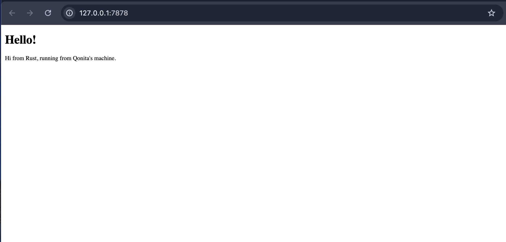

# Hello Rust Web Server

## Commit 1 Reflection Notes

Pada milestone ini, saya mempelajari pembuatan web server sederhana (single-threaded) menggunakan Rust.
Method `handle_connection` digunakan untuk membaca request dari browser melalui TCP stream. Untuk membaca data secara efisien, digunakan `BufReader` yang memproses stream baris per baris.
Request HTTP yang diterima direpresentasikan sebagai vector of strings, yang berisi informasi seperti method (GET/POST), path, host, dan headers lainnya.
Setiap kali browser mengakses server, `handle_connection` akan dipanggil dan isi request akan ditampilkan ke terminal. Dari situ bisa dilihat bagaimana alur dasar komunikasi antara client dan server terjadi.

## Commit 2 Reflection Notes

Pada milestone ini, server ditambahkan kemampuan untuk mengirim response HTML ke browser.
Method `handle_connection` diperbarui dengan membaca file menggunakan `fs::read_to_string("hello.html")`. Response HTTP kemudian disusun dari beberapa bagian: status line (`HTTP/1.1 200 OK`), header `Content-Length`, dan body berupa isi HTML.
Format response harus mengikuti standar HTTP, yaitu setiap bagian dipisahkan dengan `\r\n`.
Setelah itu, `stream.write_all()` digunakan untuk mengirim response ke browser, sehingga halaman HTML dapat dirender. Dari situ bisa dilihat bagaimana server mulai tidak hanya menerima request, tapi juga memberikan response yang sesuai.

## Commit 3 Reflection Notes

Pada milestone ini, server mulai memvalidasi request dan memberikan response yang sesuai.
Server membedakan request valid (`GET / HTTP/1.1`) dan tidak valid. Jika valid, server mengembalikan `hello.html` dengan status `200 OK`. Jika tidak, server mengembalikan `404.html` dengan status `404 NOT FOUND`.
Refactoring dilakukan menggunakan tuple `(status_line, filename)` agar kode lebih ringkas dan tidak repetitif. Jadi, perbedaan hanya pada status dan file, sementara proses membaca file dan mengirim response tetap sama.
Dari situ bisa dilihat bahwa struktur kode jadi lebih clean dan mudah dikembangkan.

## Commit 4 Reflection Notes

Pada milestone ini, dilakukan simulasi slow response pada server.
Ketika endpoint `/sleep` diakses, server akan menunggu selama 10 detik sebelum memberikan response. Karena server masih single-threaded, request lain yang masuk selama proses ini tidak bisa diproses.
Hal ini terlihat saat membuka dua tab browser: request ke `/` harus menunggu hingga request `/sleep` selesai.
Dari situ bisa dilihat bahwa single-threaded server tidak efisien untuk menangani banyak request secara bersamaan. Karena itu, diperlukan multithreading agar setiap request bisa diproses secara paralel.

## Commit 5 Reflection Notes

Pada milestone ini, server ditingkatkan menjadi multithreaded menggunakan ThreadPool.
ThreadPool dibuat dengan 4 worker. Setiap request dikirim sebagai job melalui channel `mpsc`, lalu diambil oleh worker yang tersedia. Untuk memastikan akses aman antar thread, digunakan `Arc<Mutex<>>` pada receiver.
Saat server menerima request, `pool.execute()` akan mengirim job ke worker yang idle untuk diproses.
Hasilnya, beberapa request bisa diproses secara bersamaan. Dari situ terlihat bahwa multithreaded server jauh lebih efisien dibanding single-threaded karena tidak saling blocking.